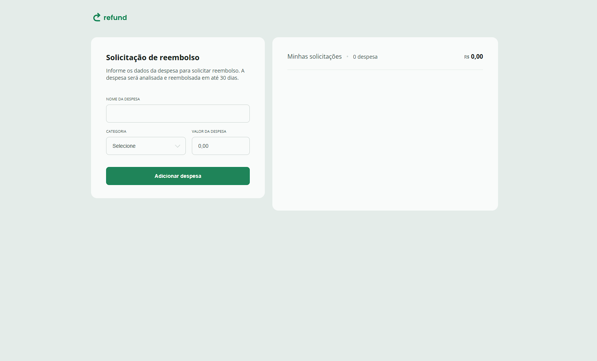

# Refund

Formulário de solicitação de reembolso de despesas, feito em HTML, CSS e JavaScript.

Demo: https://theusan777.github.io/refund-template-main/

## Preview

<p align="center">
  
</p>

## Sobre o projeto

O usuário preenche o nome da despesa, escolhe uma categoria (Alimentação, Hospedagem, Serviços, Transporte ou Outros) e informa o valor, depois clica em "Adicionar despesa". Do lado direito fica a lista "Minhas solicitações", com contador de quantas despesas foram adicionadas e o valor total somado.

## Tecnologias

- HTML
- CSS
- JavaScript (adição de despesas na lista e atualização do total em tempo real)

## Funcionalidades

- Cadastro de despesa com nome, categoria e valor
- Lista de solicitações atualizada dinamicamente
- Contador de despesas e valor total somado

## Estrutura do projeto

```
index.html
img/
  logo.svg
```

## Como executar

git clone https://github.com/theusan777/refund-template-main.git

Depois é só abrir o `index.html` no navegador.

## Deploy

[Acessar projeto](https://theusan777.github.io/refund-template-main/)

## Aprendizados

Pratiquei manipulação de lista em JavaScript (adicionar itens dinamicamente) e soma de valores em tempo real conforme o usuário interage com o formulário.
